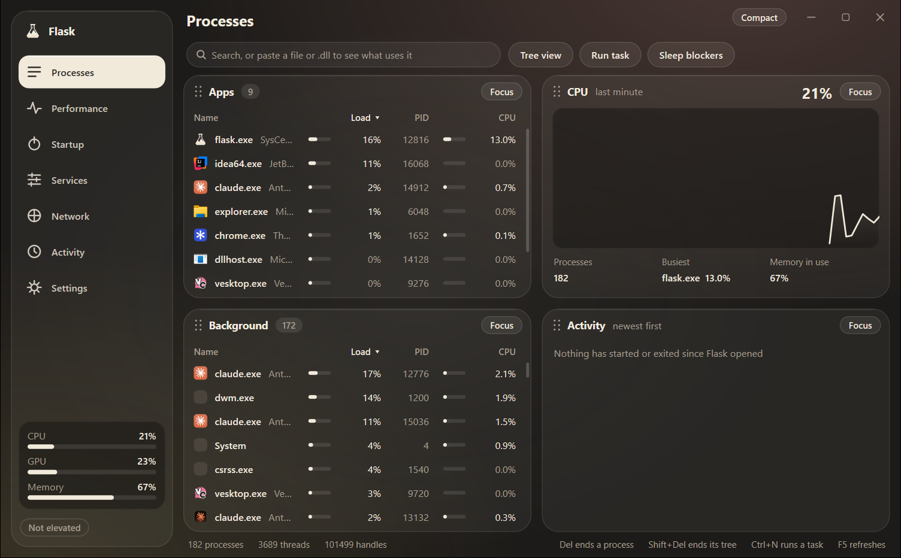
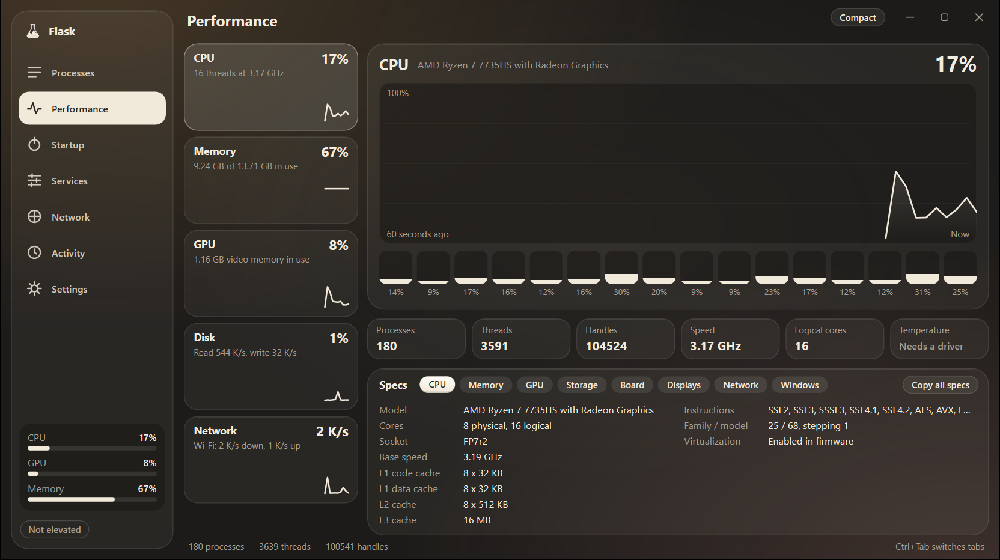
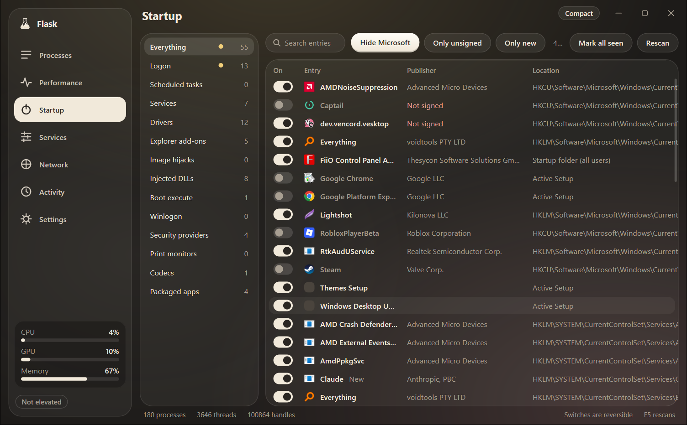
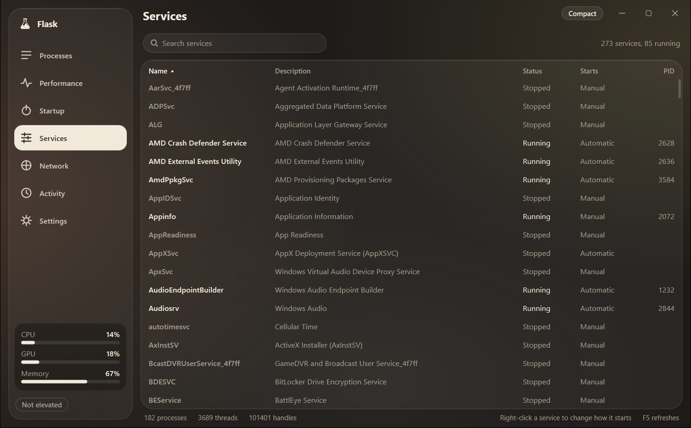

<div align="center">


# Flask

**A task manager for Windows that shows what is running, why it started, and what it is doing.**




</div>

## What Flask is for

Windows Task Manager tells you what is using the CPU. Flask also answers the next questions: where did this program come from, what makes it start, which file is it holding open, and what is it connected to.

It is one small native executable, under 1 MB. It needs no runtime, makes no network requests of its own, and can take over <kbd>Ctrl</kbd>+<kbd>Shift</kbd>+<kbd>Esc</kbd> from Task Manager.

## Features

| Tab | What it does |
| --- | --- |
| **Processes** | Apps and background processes, sorted heaviest first by a combined CPU, GPU, memory and disk load. End, restart, suspend, or set priority and affinity, and have Flask reapply them each time the program starts. |
| **Performance** | Live graphs for every CPU core, memory, GPU, disk and network, plus a full hardware and Windows specs sheet you can copy. |
| **Startup** | Every place that can start code without asking: logon entries, scheduled tasks, services, drivers, Explorer add-ons, image hijacks and injected DLLs. Each entry has a reversible switch. Unsigned and new entries are flagged. |
| **Services** | Every Windows service. Start, stop, or change how it starts. |
| **Network** | Every open TCP and UDP endpoint and the process behind it. |
| **Activity** | A running log of processes starting, exiting and staying busy. |

More tools on the Processes tab:

- **Origin**: who signed a process's file, where it was downloaded from, and what makes it start. One click looks its SHA-256 up on VirusTotal.
- **File locks**: paste a file or `.dll` path into the search box to see which processes hold it open.
- **Sleep blockers**: see what keeps the PC or screen awake.
- **Compact view**: a small CPU, GPU and memory meter that can stay on top.

## Screenshots

| Performance | Startup |
| --- | --- |
|  |  |

<details>
<summary>Services</summary>



</details>

## Build

Flask needs Windows 10 or 11 (x64) and a [Rust](https://rustup.rs) toolchain that supports the 2024 edition (1.85 or newer).

```powershell
cargo build --release -p flask
```

The result is `target\release\flask.exe`. It asks for administrator rights so that it can inspect processes owned by other accounts. For a development build that runs without elevation, alongside an installed copy:

```powershell
cargo run -p flask --features unelevated
```

To package an installer you also need [Inno Setup 6](https://jrsoftware.org/isinfo.php) (`winget install JRSoftware.InnoSetup`):

```powershell
.\build-installer.ps1
```

The installer is written to `installers\`. An all-users install can offer to open Flask in place of Task Manager.

## How it is built

Flask is a Cargo workspace of three crates. The only dependencies are Microsoft's [`windows`](https://crates.io/crates/windows) crates.

| Crate | Role |
| --- | --- |
| [`sc-core`](crates/sc-core) | Data collection and system actions. No UI code. |
| [`sc-ui`](crates/sc-ui) | A small Direct2D toolkit: one window, custom-drawn widgets, repaint only when something changed. |
| [`flask`](crates/flask) | The application: tabs, settings and the background sampler. |

A background thread takes the process snapshots, so the UI thread never waits on the system.

## License

[MIT](LICENSE)
